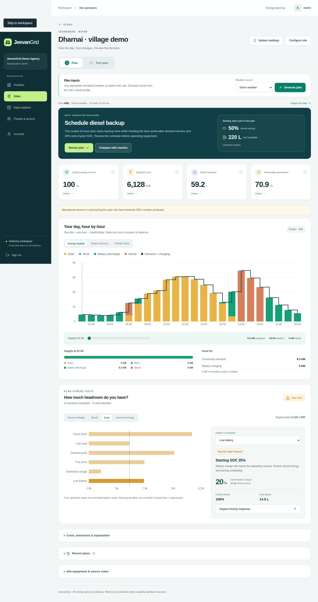
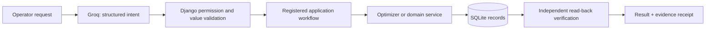
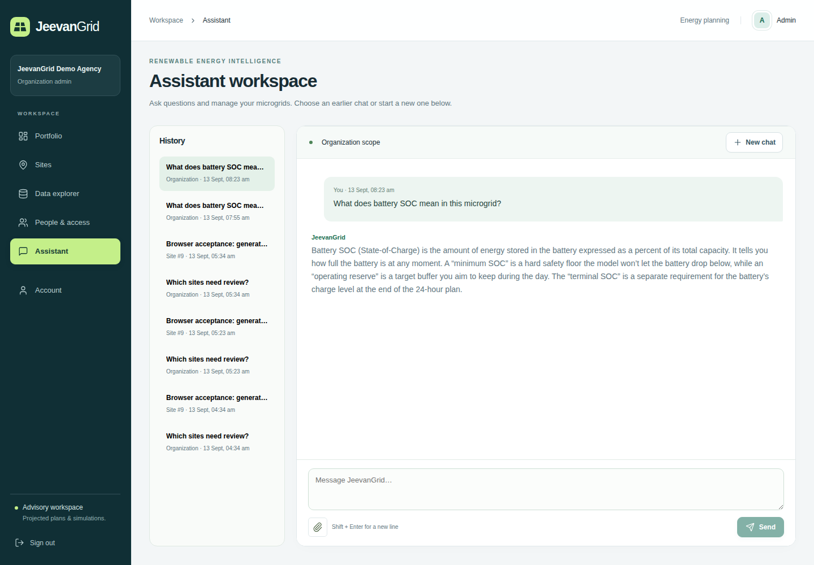
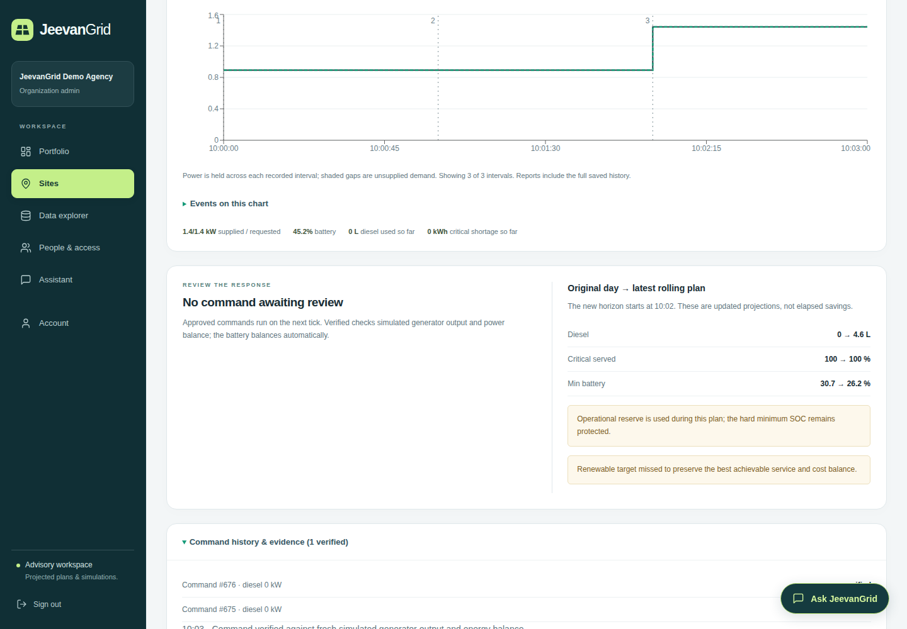
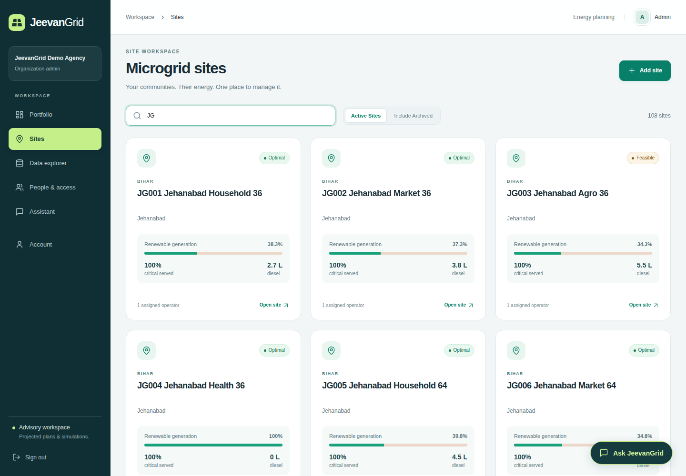
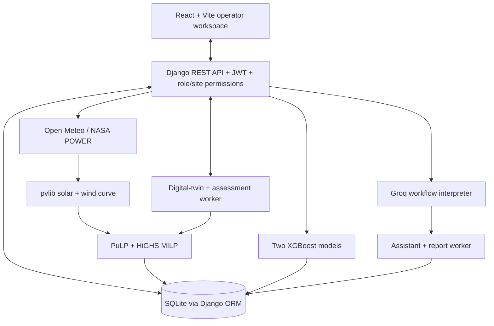

# JeevanGrid

### Microgrid energy intelligence for off-grid communities

**JeevanGrid converts weather, demand, equipment limits and live operating state into a reliable 24-hour energy plan for solar, wind, batteries and diesel.** It protects critical demand first, then reduces operating cost, diesel consumption and emissions wherever the site configuration allows.

[](frontend/)
[](backend/)
[](backend/grid/optimizer.py)
[](backend/grid/forecasting.py)
[](backend/grid/tests/)

> **The core idea:** renewable energy should be used aggressively—but never by gambling with the electricity needed for lighting, water, communications or clinic loads.

<p align="center">
  
</p>

## The problem

Rural and off-grid microgrids may combine solar, wind, batteries and diesel backup. The difficult part is not installing multiple sources; it is deciding **what should run, charge or wait at each hour** when:

- sunlight and wind are uncertain;
- batteries have safety limits and finite useful life;
- diesel is reliable but expensive and carbon-intensive;
- generator starts, ramping and minimum run times matter; and
- critical community demand must remain supplied.

Rule-based operation can waste renewable energy, cycle batteries unnecessarily, start diesel too late, or preserve cost at the expense of reliability. JeevanGrid turns this into a transparent constrained optimization problem.

## The solution in one minute

```text
Site equipment, costs and operating rules
                  +
Weather forecast and demand profile
                  +
Current battery SOC, fuel and generator state
                  ↓
Solar, wind and demand estimation
                  ↓
Reliability-first MILP optimization
                  ↓
24-hour renewable, battery and diesel schedule
                  ↓
Plain-language operator recommendation
                  ↓
Approve, override, test a disruption or replan
```

JeevanGrid is an **advisory supervisory controller**. The current version calculates and simulates decisions; it does not send commands to physical equipment.

## What is implemented

| Capability | What JeevanGrid does |
|---|---|
| **Guided site configuration** | Captures location, equipment, demand classes, flexible loads, costs, reliability policy and engineering limits. Location search resolves coordinates and timezone. |
| **Weather-to-energy modelling** | Retrieves Open-Meteo forecasts or NASA POWER history, records source and age, converts irradiance and temperature through `pvlib`, and applies a hub-height wind curve. |
| **24-hour optimization** | Uses PuLP with HiGHS to schedule solar, wind, battery charge/discharge, diesel and flexible work over 24 hourly intervals. |
| **Reliability-first priorities** | Minimizes critical shortage before normal shortage, flexible-work shortfall and operating cost. Infeasible plans are reported rather than fabricated. |
| **Real generator and storage rules** | Enforces SOC limits, efficiencies, terminal reserve, power limits, battery wear, generator minimum output, ramping, minimum run/cooldown, start limits, fuel availability and allowed hours. |
| **Scenario simulation** | Runs cloudy, low-wind, high-demand, expensive-fuel, generator-outage and low-battery tests through the **same optimizer** used for the base plan. Custom combinations are also supported. |
| **Live software digital twin** | Streams simulated telemetry over WebSockets, injects disruptions, replans on the simulated five-minute clock and verifies operator-approved commands inside the simulator. |
| **Operator decision trail** | Saves plan confirmation or override, reason, frozen input snapshot, hourly dispatch and source provenance. |
| **Multi-site operations** | Provides Admin/Operator access control, assignments, normalized portfolio comparison, resilience status, plan history and CSV/PDF/JSON evidence exports. |
| **Agentic assistant** | Turns natural-language requests into permission-scoped, validated application workflows that can create real database records and verify the result. |
| **ML pipeline** | Trains and evaluates XGBoost demand forecasting and solar-residual correction models with chronological validation and automatic baseline fallback. |

## Optimization: the decision-making core

JeevanGrid solves a mixed-integer linear program (MILP). For every hour, it chooses renewable use, battery action, generator state and flexible-load timing while maintaining the energy balance:

```text
solar + wind + battery discharge + diesel
= served demand + flexible work + battery charging
```

The solver uses ordered objectives:

1. Serve as much critical demand as physically possible.
2. Serve normal demand.
3. Complete flexible work within its permitted window.
4. Minimize fuel, generator starts, estimated battery wear, curtailment and renewable-target shortfall.

This ordering prevents a monetary penalty from making the optimizer sacrifice critical service merely to produce a cheaper-looking plan. Operators can select **Lowest Cost**, **Balanced** or **Lowest Emissions**, but reliability retains priority.

Calculated metrics include critical-load service, total energy service, renewable share, diesel litres, dispatch cost, CO₂ emissions, minimum SOC, terminal SOC and reserve compliance. Every hourly interval is checked for power balance.

## Agentic AI that performs verified work

The assistant is powered by Groq using `openai/gpt-oss-120b`, but the language model is **not** allowed to control the database or calculate dispatch directly.



Implemented assistant workflows include:

- creating, updating, assigning, archiving and restoring sites;
- recording SOC, fuel, generator state and demand events;
- importing a validated 24-hour demand CSV;
- generating plans and testing scenarios;
- comparing compatible sites and plans;
- starting, pausing and disrupting a software replay;
- confirming plans and reviewing simulated commands;
- training forecast models; and
- exporting PDF, CSV and JSON reports.

Each workflow has typed inputs, a fixed step sequence, role and site checks, durable progress, retry handling and persisted receipts. Mutations are read back from Django before success is reported. The assistant has no arbitrary SQL or Python execution path.

<p align="center">
  
</p>

### Example database-writing prompt

```text
Generate a 24-hour plan for JG004 Jehanabad Health 36 using simulated weather.
```

In the verified demo, that request created one `OptimizationRun`, 24 baseline `DispatchInterval` rows and six linked scenario runs. The LLM interpreted the request; Django authorized it; the MILP computed the schedule; the workflow verified the stored records.

## Machine learning with a defined job

JeevanGrid does not use ML as decoration and does not claim to predict the weather provider. Open-Meteo supplies the forecast; the ML layer improves site-specific estimates when sufficient observations exist.

### 1. XGBoost demand forecasting

- Inputs: hour, weekday, temperature, saved demand baseline and solar-physics estimate.
- Output: expected hourly demand in kW.
- Purpose: learn repeatable time, temperature and usage patterns that a fixed daily curve misses.

### 2. XGBoost solar-residual correction

- Baseline: `pvlib` converts forecast irradiance and temperature into expected PV power.
- Target: the difference between observed PV output and the physics estimate.
- Purpose: learn persistent site effects such as soiling, shading or systematic model bias without replacing physical bounds.

### Validation and fallback

```text
65% chronological training → 17% calibration → 18% untouched testing
```

- The model is eligible only if calibration MAE beats the baseline by more than 2%.
- Otherwise JeevanGrid keeps the physics/baseline estimate.
- Calibration residuals provide conservative lower and upper bounds.
- Predictions remain non-negative, zero at night and capped by installed capacity.
- The UI supports 90 days / 2,160 hours of clearly labelled synthetic training data or uploaded observations.

> **Current boundary:** model training, evaluation, persistence and inference are implemented. The standard Plan and Live Replay screens currently use saved demand and physics estimates; ML is not automatically enabled in those screens. Synthetic backtest scores demonstrate the pipeline—not field accuracy.

## Simulation and live replanning

The digital twin is the safe bridge between a planning prototype and a future controller:

1. It emits simulated demand, PV, SOC, fuel and generator state.
2. WebSockets update the Live Control interface without manual refresh.
3. A disruption or simulated five-minute interval triggers rolling replanning.
4. The system proposes a generator command with an explanation.
5. The operator approves or rejects it.
6. The simulator executes it and verifies the resulting generator output and power balance.

<p align="center">
  
</p>

This proves the software control loop and human-in-the-loop workflow. Field deployment still requires authenticated meters, inverter/BMS/generator adapters, electrical interlocks and commissioning.

## Demonstrated resilience case

For the saved **JG004 Jehanabad Health 36** model:

| Result | Baseline | Solar availability −50% |
|---|---:|---:|
| Critical energy served | 100% | 100% |
| Diesel required | ~0 L | 1.57 L |
| Minimum battery SOC | 30.74% | 20% |
| End-of-plan SOC | 58.84% | 30% |

The important result is not a manufactured diesel saving. When solar falls, the optimizer deliberately uses reserve and adds backup generation to preserve essential supply. This is a **simulated-weather, modelled-demand result**, not a field-performance claim.

## Credible and inspectable data

JeevanGrid labels every input as `study`, `weather_api`, `operator`, `csv` or `simulated`.

- **Published reference:** the Leporiang study provides surveyed/modelled demand and system capacities for the reference configuration.
- **Historical weather:** NASA POWER supplies regional hourly irradiance, temperature and wind.
- **Forecast weather:** Open-Meteo supplies coordinate-based hourly forecasts with retrieval time and freshness checks.
- **Operator data:** equipment ratings, costs, policies, SOC and fuel remain explicit user inputs.
- **Engineering-modelled portfolio:** 108 inspectable demonstration sites use deterministic appliance and pump-energy calculations—not LLM-generated or random values.

The 108 sites and their 27 fictional operators demonstrate portfolio workflows; they are **not 108 monitored installations**. Regional weather is not site telemetry, and saved run data is intentionally excluded from Git.

<p align="center">
  
</p>

Primary sources:

- [Leporiang hybrid microgrid study](https://ietresearch.onlinelibrary.wiley.com/doi/10.1049/joe.2017.0447)
- [NASA POWER hourly API](https://power.larc.nasa.gov/docs/services/api/temporal/hourly/)
- [Open-Meteo forecast documentation](https://open-meteo.com/en/docs)
- [Gram Oorja village mini-grid reference](https://gramoorja.in/wp-content/uploads/2024/12/Micro-GridPaper.pdf)
- [Tata Power solar microgrids](https://www.tatapower.com/renewables/solar-microgrids)

## System architecture



| Layer | Technology |
|---|---|
| Frontend | React 19, Vite, React Router, Recharts, Leaflet, Lucide |
| Backend | Django, Django REST Framework, JWT, ASGI/WebSockets |
| Energy modelling | pandas, NumPy, `pvlib`, configurable wind power curve |
| Optimization | PuLP mixed-integer model with HiGHS solver |
| Machine learning | XGBoost regressors with chronological evaluation |
| Agentic workflows | Groq structured output, registered Django operations, read-back verification |
| Storage | SQLite for the hackathon MVP; models remain portable to PostgreSQL |
| Reports | ReportLab PDF plus CSV/JSON evidence exports |

## Who uses it

- **Microgrid operator:** updates the current state, generates a plan, tests disruptions, reviews recommendations and records overrides.
- **Organization administrator:** configures equipment and safety rules, assigns operators, compares sites and runs portfolio resilience checks.
- **Electrification agency or NGO:** uses normalized reliability, fuel, cost and emissions evidence to identify sites needing attention.

Permissions are enforced in Django, not only hidden in React.

## Run locally

Requirements: Python 3.12+ and Node.js 22.12+.

```bash
git clone git@github.com:Heer3788/JeevanGrid.git
cd JeevanGrid

python3 -m venv backend/.venv
backend/.venv/bin/python -m pip install -r backend/requirements.txt
backend/.venv/bin/python backend/manage.py migrate
backend/.venv/bin/python backend/manage.py seed_demo --with-runs

cd frontend
npm ci
cd ..

python3 backend/dev.py
```

Open **http://127.0.0.1:5173**. The launcher starts the Django API, Vite frontend, live-simulation worker and assistant/report worker. Manual planning, simulation and reports work without an LLM key.

To enable the assistant:

```bash
cp backend/.env.example backend/.env
```

Add your local `GROQ_API_KEY` to `backend/.env`, then restart. The real `.env`, SQLite database, model artifacts and generated reports are ignored by Git.

Windows setup and separate-service commands are documented in [backend/README.md](backend/README.md).

## Test the implementation

```bash
# Backend physics, optimization, permissions, AI workflows and live lifecycle
backend/.venv/bin/python -m pytest -q backend/grid/tests

# Frontend production build
cd frontend
npm run build
```

Current verified result: **141 backend tests passed** and the React production build completed successfully. Browser walkthroughs live under [`frontend/tests`](frontend/tests/).

## What makes JeevanGrid different

1. **Reliability is mathematical, not decorative.** Critical service is optimized before financial tradeoffs.
2. **Simulation and planning cannot disagree.** Baseline, scenarios and rolling replans use the same physical model and solver.
3. **AI actions are accountable.** Natural language becomes a validated workflow, persisted records and a verification receipt—not hidden SQL.
4. **ML must earn its place.** Chronological calibration decides whether a model is used; the baseline remains available.
5. **Data limitations are visible.** Study values, weather APIs, operator inputs and simulations are never silently mixed.
6. **The path to field control is explicit.** The digital twin exercises the control contract without claiming uncommissioned hardware integration.

## Current scope and field roadmap

### Built now

- End-to-end advisory energy planning
- Weather-aware solar and wind estimation
- Reliability-first mixed-integer optimization
- Battery and generator operational constraints
- Scenario simulation and portfolio comparison
- Live software twin with human-approved simulated commands
- Verified agentic workflows and report generation
- XGBoost training, evaluation, fallback and conservative bounds

### Required before controlling a physical microgrid

- Authenticated telemetry from meters, inverter, battery BMS and generator controller
- Commissioned Modbus/MQTT or vendor-specific gateway adapters
- Electrical protection, safety interlocks, fail-safe and manual-local-control procedures
- Field demand/PV history and issue-time forecast backtesting
- Planned-versus-measured dispatch and device acknowledgement tracking
- PostgreSQL, production job infrastructure, TLS, monitoring and backups
- Sub-hourly electrical control only after voltage, frequency, protection and transient modelling

## Documentation

- [Five-minute final-round showcase](backend/docs/FINAL_ROUND_SHOWCASE.md)
- [Complete product walkthrough](backend/docs/LIVE_WALKTHROUGH.md)
- [Agentic assistant and verification contract](backend/docs/ASSISTANT.md)
- [Optimization and modelling notes](backend/docs/MODEL_NOTES.md)
- [Portfolio construction and provenance](backend/docs/PORTFOLIO_DATA.md)
- [Reference data sources](backend/docs/SEED_DATA.md)
- [Landing-to-demo video guide](backend/docs/LANDING_TO_DEMO_VIDEO.md)

---

**JeevanGrid turns changing conditions into an energy decision an operator can inspect, approve and defend.**
